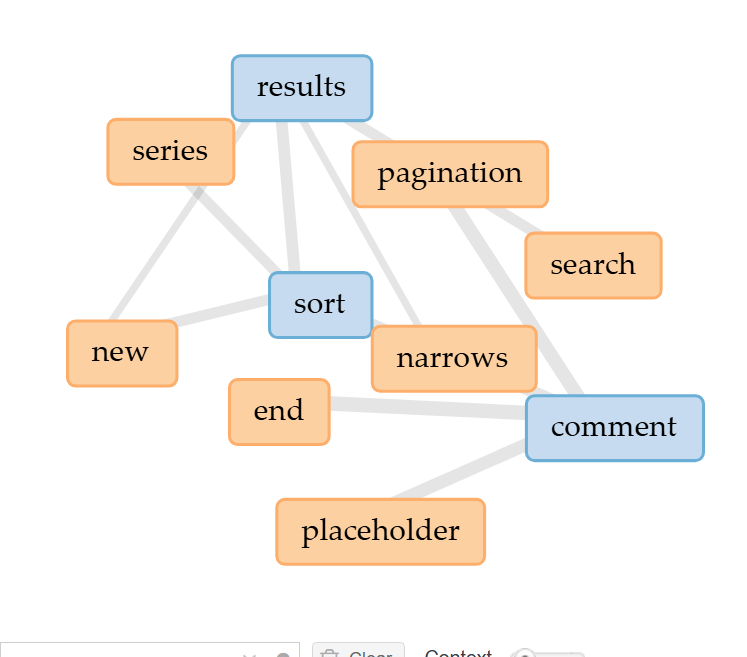
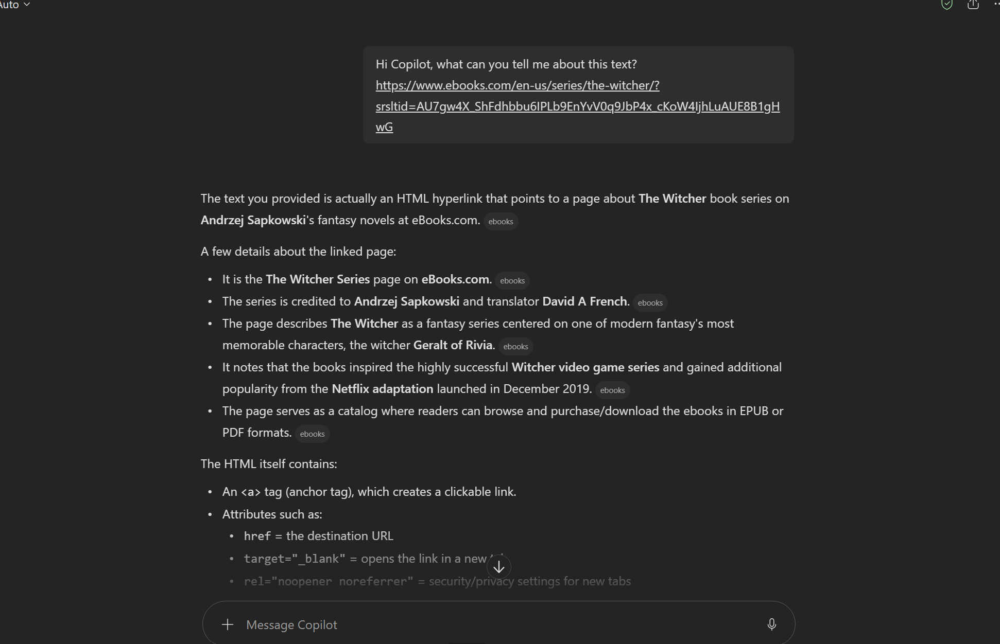
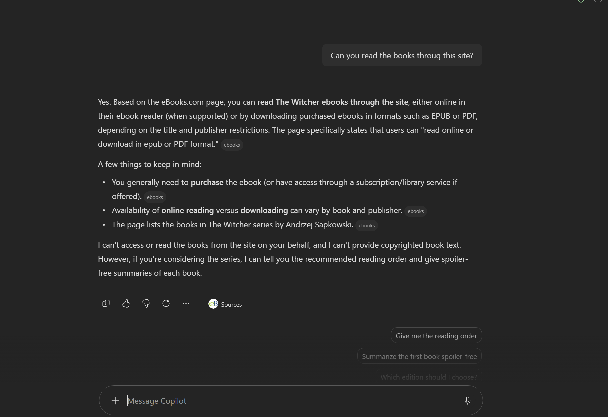



# Distant Reading Assignment 

I used Voyant to search this website! [Witcher Website!](https://www.ebooks.com/en-us/series/the-witcher/?srsltid=AU7gw4X_ShFdhbbu6IPLb9EnYvV0q9JbP4x_cKoW4IjhLuAUE8B1gHwG)

I learned that I can see the most searched words through Voyant. As well as similar words or anything that connects text-wise. I can't see the context within the website itself.

Check out my image!

....

I also tried Copilot with ChatGPT-5, and here's a bit of our conversation!

